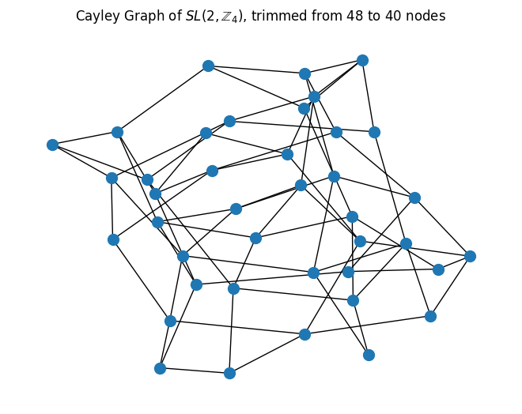
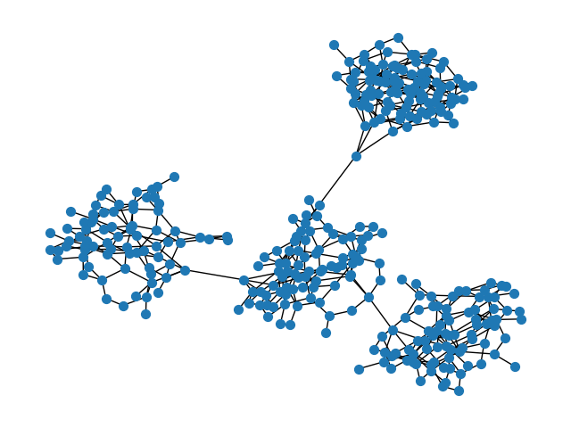

# Commute-time-optimal graphs for GNNs

## Setup

```
conda create --prefix /path/to/here/l65-env python=3.11
conda activate /path/to/here/l65-env

pip install torch torchvision torchaudio --extra-index-url https://download.pytorch.org/whl/cu113

pip install -r requirements.txt
```

## Generating Cayley Graphs

```python
V = 40 # The number of vertices of the input graph

generator = CayleyGraphGenerator(V) # Instantiate the Cayley graph generator by computing the size of the smallest Cayley graph with at least V nodes
generator.generate_cayley_graph() # Generate the Cayley graph
generator.trim_graph() # Trim the Graph with BFS to have V nodes again
generator.visualize_graph() # Visualize the graph (optional trimmed=False to see graph before trimming)
```




## Models

Currently, we are only working with a GIN convolution model. Graph Isomorphism Network (GIN) introduced here: https://arxiv.org/abs/1810.00826. 

Our implementation `MyGINConv` of the convolution (in particular, the definition of the MLP), mimics the definition in the EGP (Wilson + Velikovic) code. `num_layers` of this module, combined with linear input and output projections, make up our `GINModel`. 

All models are compatible with graph batching. 


## Training

Run `python3 train.py` to run with all defaults. 


The dataset is loaded with the rewiring choice. For the `SalientDists` synthetic data, availble rewirings are: `"cayley"` (Cayley expander graph), `"interacting_pairs"` (all pairs that pairwise interact per the definition of this dataset) and `"fully_connected"` (all nodes connected). For the `ColourInteract` synthetic data, availble rewirings are: `"cayley"` (Cayley expander graph), `"cayley_clusters"` (nodes of the same colour form a cayley subgraph, and subgraphs are sparsely connected with a single extra node/cluster) and `"fully_connected"`


